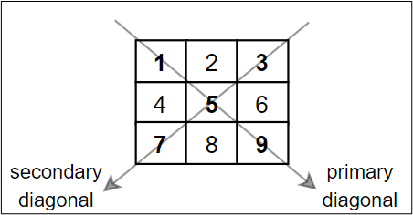

# PUA ECPC 2023 cheat sheet 
## Content
- [libraries](#libraries)
- [code templates](#code-templates)
- [input and output](#input-and-output)
- [important built-in functions](#important-built-in-functions) 
- [Arrays](#Arrays) 
- [STLs](#STLs) 
- [important functions](#important-functions) 
- [background](#background)
- [bit manipulation](#bit-manipulation)
- [matrices](#matrix)
- [maths](#maths)
- [goniometry](#goniometry) 

## code templates
```cpp
#include <limits>
#include <iomanip>
#include <cstdlib>
#include <cstdio>
#include <iostream>
#include <cassert>

#include <string>
#include <string.h>

#include <vector>
#include <list>
#include <queue>
#include <stack>
#include <deque>
#include <map>
#include <unordered_map>
#include <set>
#include <unordered_set>

#include <bitset>

#include <algorithm>
#include <numeric>
#include <cmath>

#define ull unsigned long long 
#define ll long long
#define fastinout                 \
	ios_base::sync_with_stdio(0); \
	cin.tie(0);                   \
	cout.tie(0);
#define testcases \
	ll t;         \
	cin >> t;
#define all(x) (x).begin(), (x).end()
#define print(x)          \
	for (auto i : (x))    \
	{                     \
		cout << i << " "; \
	}
#define mkp make_pair
using namespace std;
```
## input and output
### Input from Files 
Input may be from file, use the same file name stated in the statement.<br>
```cpp 
#include<fstream>
ifstream fin("student.doc");
ofstream fout("student.doc");
fin>>num; fout<<num;  // read/write data from/to the file student
fin.close();fout.close();
```
### fast input and output
```cpp
ios_base::sync_with_stdio(0);
cin.tie(0);
cout.tie(0);
```
### printf function
printf( ${\color{blue}string}$ , ${\color{red}value}$); <br/>
the ${\color{blue}string}$ represents the exact format which will be printed. <br/>
it must include the sign `%` because the parameter ${\color{red}value}$ will be placed in it's place. <br/>
the sign `%` in the ${\color{blue}string}$ is followed by a character representing the data type of the ${\color{red}value}$  as in the examples.<br/>
**example 1 :**
```cpp
%c	// print char
%d 	// print integer
%f	// print double 
%e	// print double as exponent notation (scientific) 
%o	// print int as octal
%x	// print int as hexa
%a	// print double as hexa
```
the sign `%` in the ${\color{blue}string}$ may also be followed by `number` or `.number` representing the `minimum langth` of the  ${\color{blue}string}$. <br/>
if the string was shorter than the `minimum langth` :
in case of `number` the sequence of `spaces` was added to the begining of the string. <br/>
in case of `.number` the sequence of `zeros` was added to the begining of the string. <br/>
**example 2 :**
```cpp
printf("%d", 97); 		//97
printf("%6d", 97);		//    97
printf("%.6d", 97);		//000097
```
when the value data type is `double` ,in this case ,the `.number` represent the number of digits after the decimal point. <br/>
**example 3 :**
```cpp
printf("%f", n);	//97.123400
printf("%12f", n);	//   97.123400
printf("%.12f", n);	//97.123400000000
```
## important built in functions 
### String
```cpp
to_string(int);
stoi(string);
isalpha(ch);
isdigit(ch);
```
### numbers
```cpp
min(a,b);
max(a,b);
swap(a,b);
floor(a);
ceil(a);
round(a);
sqrt(a); //used to calculate the square root of number
cbrt(a); //used to calculate the cube root of number
abs(a);  //returns the absolute value of number
pow(a,b);
log2(a);
```
## Arrays
Note :
`arr , arr+size` === `v.begin(), v.end()` <br>
`arr , arr+size` used with an array<br>
`v.begin(), v.end()` used with any STLs
- **basic**
```cpp
sort( v.begin(), v.end());
reverse( v.begin(), v.end() );
fill( v.begin(), v.end() , val );
find(v.begin(), v.end(), a);

int MinValue = *min_element( v.begin(), v.end());
int MaxValue = *max_element( v.begin(), v.end() );
int index = find( v.begin(), v.end() , val ) -v.begin();
```
- **advanced**
```cpp
next_permutation( v.begin(), v.end());
upper_bound(  v.begin(), v.end() , val );// time : log2(size) + O(1) //first element e when ( e > val ) arr is sorted
lower_bound(  v.begin(), v.end() , val );// time : log2(size) + O(1) //first element e when ( e >= val ) arr is sorted
index = upper_bound( v.begin(), v.end(), 3) - v.begin();
value = *upper_bound( v.begin(), v.end(), 3);
```
## STLs
- **map**
```cpp
map_name.insert({ key, val });
map_name.insert(iterator position, {key, element});// inserts element in position (for unordered map)
mp2.insert(mp1.begin(), mp1.end());	// inserts all elements in range [begin, end] from mp1 into mp2
auto it = map_name.find(key);		// O(log n)
map_name.erase(it);	// O(1)
map_name.erase(key);	// O(1)
map1_name = map2_name;	//the map2 is assigned into map1 by destroying map1's elements // O(n*log n)
map_name.count(key)
```
- **set**
```cpp
set_name.insert(element);
set_name.insert(iterator position,  element);	// inserts element in position (for unordered set)
set2.insert(set1.begin(), set1.end());		// inserts all elements in range [begin, end] from set1 into set2
auto it = map_name.find(key);	// O(log n)

myset.erase(position);		// dlete element in position (0 indexed)
myset.erase(pos1, pos2); 	// dlete all elements from pos1 to pos2 inclusive (0 indexed)

set_name.emplace(value); 	//The value is added to the set if the set does not contain that element already.
set2_name.swap(set2_name); 	// O(1)
set_name.count(element); 	//The function returns 1 or 0 as the set contains unique elements . //O(log n)
```
## important functions 
### GCD
Greatest Common Divisor (GCD) or Highest Common Factor (HCF) of two numbers is the largest number that divides both of them. 
```cpp
int GCD(int a, int b) {
	if (!b)return a;
	return GCD(b, a % b);
}
```
### LCM
Least Common Multiple (LCM) of two numbers is the smallest number which can be divided by both numbers. 
```cpp
int LCM(int a, int b)
{
    return (a / GCD(a, b)) * b;
}
```


## background 
### ASCII
| char  | ASCII |
| ------ | -------- |
| 0 – 9  | 48 – 57  |
| A – Z  | 65 – 90  |
| a – z  | 97 – 122 |

## bit manipulation
### count bits
```cpp
int countNumBits(int mask) {
	int ret = 0;
	while (mask) 	{
		mask &= (mask-1);
		++ret;	// Simply remove the last bit and so on
	}
	return ret;
}
```
### print submasks of a length
```cpp
void printAllSubsets(int len){
	for (int i = 0; i < (1<<len); ++i)
		printNumber(i, len);
}
```
### print submasks of a mask
Note : this code doesn't print 0
```cpp
void getAllSubMasks(int mask) {
	for(int subMask = mask ; subMask ; subMask = (subMask - 1) & mask)
		printNumber(subMask, 32);	
}
```
### graycode 
```cpp
int getGrayCode(int n){
	return n^(n>>1);
}
```
## matrix
  <br>

## maths
to check if n is :<br>
divisible by 8 : last 3 digits of n is forming a number which is divisible by 8

## goniometry
the length between (x1,y1) and (x2,y2) is :
```cpp
double len = sqrt( pow(x2-x1 , 2) + pow(y2-y1 , 2) ); 
```
